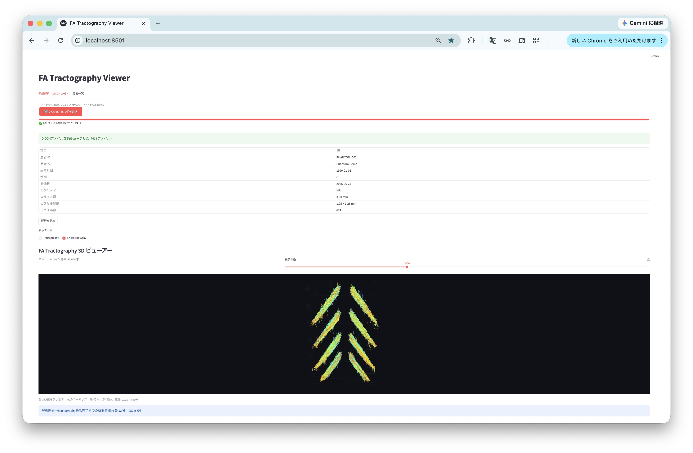
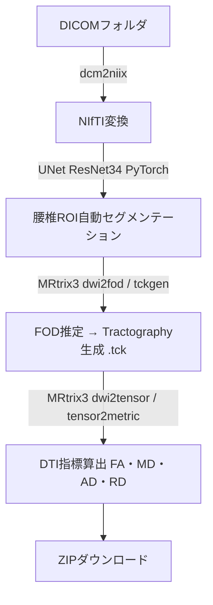
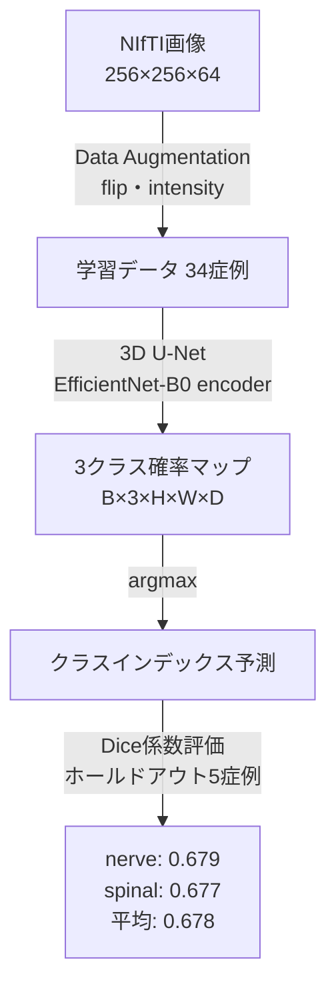

# Portfolio — Shuzo Tanaka

医療画像 × AI × Webアプリ開発のポートフォリオです。

> **Note:** 研究・企業共同開発のプロジェクトのため、一部ソースコードはPrivateリポジトリで管理しています。  
> このリポジトリはアーキテクチャ概要・技術ドキュメントを公開するためのものです。  
> ★ 3D U-Net セグメンテーションモデルは **公開リポジトリ** で確認できます → [ShuzoTanaka/3DU-Net](https://github.com/ShuzoTanaka/3DU-Net)

---

## Project: 腰椎MRI Tractography Viewer

### 概要

腰椎拡散強調MRI（DWI/DTI）を入力とし、AIによるROI自動セグメンテーションから  
Tractography・DTI指標の算出まで、ブラウザ上で完結するWebアプリケーションです。  
医療機関との共同研究として開発中です。

### 成果

| 項目 | 内容 |
|---|---|
| セグメンテーション精度 | **Dice係数 0.68**（腰椎ROI、卒業研究） |
| 学会発表 | 4件（筆頭・口演）うち1件は日仏整形外科合同会議にて英語口演 |

### Tech Stack

| カテゴリ | 技術 |
|---|---|
| フロントエンド | Streamlit |
| コンテナ | Docker / Docker Compose |
| AI推論 | PyTorch・UNet ResNet34（セグメンテーション） |
| MRI解析 | MRtrix3（FOD・Tractography・DTI指標） |
| DICOM処理 | dcm2niix・pydicom |

### 処理フロー

### 主な技術的チャレンジ

- **Python 3.11固定**: MRtrix3 3.0.4が`import imp`を使用（Python 3.12で廃止）。バージョン管理を徹底。
- **マルチステージDockerビルド**: MRtrix3のC++コンパイル（30〜60分）をStage1に分離し、本番イメージを軽量化。
- **ヘッドレス環境対応**: `opencv-python-headless`・VTK非表示環境でのパイプライン設計。
- **Debian Trixieライブラリ問題**: `libfftw3-3`が`libfftw3-3t64`にリネームされた変更を`-dev`パッケージ経由で回避。
- **DICOMメタデータ解析**: 患者情報・シリーズ判別のための堅牢なDICOM読み込み設計。

---

## Project: 腰椎神経・脊髄セグメンテーション

**ソースコード公開中** → [github.com/ShuzoTanaka/3DU-Net](https://github.com/ShuzoTanaka/3DU-Net)

### 概要

腰椎MRI（NIfTI形式）を入力とし、**背景・神経・脊髄の3クラス**を自動セグメンテーションする3D U-Netモデルです。  
PyTorch Lightningで実装し、EfficientNet-B0エンコーダを用いた3次元ボリューム処理を実現。  
データリークを厳密に排除した評価設計により、**Dice係数0.68を達成**しました。

### 成果

| 項目 | 内容 |
|---|---|
| **nerve（神経）Dice** | **0.6794** |
| **spinal（脊髄）Dice** | **0.6768** |
| **nerve + spinal 平均** | **0.6781** |
| 学習症例数 | 34症例（ホールドアウト5症例を完全除外） |
| テスト症例数 | 5症例（学習に未使用の独立ホールドアウト） |
| 学会発表 | 4件（筆頭・口演）うち1件は日仏整形外科合同会議にて英語口演 |

### Tech Stack

| カテゴリ | 技術 |
|---|---|
| フレームワーク | PyTorch Lightning 2.4.0 |
| アーキテクチャ | 3D U-Net（segmentation-models-pytorch-3d） |
| エンコーダ | EfficientNet-B0 |
| 損失関数 | Dice Loss（multiclass） |
| オプティマイザ | Adam + CosineAnnealingLR（T_max=200） |
| 入力形式 | NIfTI（256×256×64 voxels、グレースケール） |
| 出力クラス | 3クラス（背景 / 神経 / 脊髄） |
| GPU | NVIDIA GeForce RTX 4080 |

### 処理フロー

### 主な技術的チャレンジ

- **データリーク対策**: テスト5症例（HOLDOUT_CASES）を学習データから完全除外する`DataModuleSafe`を独自設計。
- **損失関数の比較実験**: Dice Loss単体 vs Dice+CE Lossを比較し、Dice単体のほうが精度・収束安定性ともに優れることを確認（nerve: +0.034 Dice改善）。
- **データ分割の影響調査**: seed=42固定 vs ランダム分割を比較実験し、ランダム分割のほうが頑健な検証セットを得られることを定量的に確認。
- **3D入力の効率化**: バッチサイズ2・CosineAnnealingLRにより、RTX 4080上でのVRAM使用を最適化しながら200エポック安定学習。
- **NIfTI/nnUNet形式の統合**: 既存データ（NIfTI）とDataset001_lumber（nnUNet形式）の両形式を統合する汎用Datasetクラスを実装。

---

## Project: FiberFox（開発中）

拡散MRIシミュレーションツール。  
公開データセットやダミーデータを用いたパイプライン検証・デモ用途を目的として開発中。

---

## Contact

- GitHub: [github.com/ShuzoTanaka](https://github.com/ShuzoTanaka)
- Email: syuzo.recruit@gmail.com
