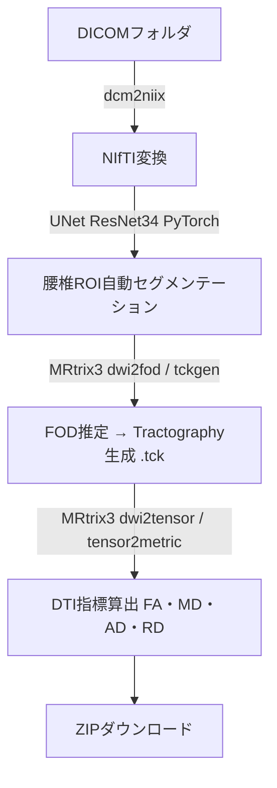

# Portfolio — Shuzo Tanaka

医療画像 × AI × Webアプリ開発のポートフォリオです。

> **Note:** 研究・企業共同開発のプロジェクトのため、ソースコードはPrivateリポジトリで管理しています。  
> このリポジトリはアーキテクチャ概要・技術ドキュメントを公開するためのものです。

---

## Project: 腰椎MRI Tractography Viewer

### 概要

腰椎拡散強調MRI（DWI/DTI）を入力とし、AIによるROI自動セグメンテーションから  
Tractography・DTI指標の算出まで、ブラウザ上で完結するWebアプリケーションです。  
医療機関との共同研究として開発中です。

### 成果

| 項目 | 内容 |
|---|---|
| セグメンテーション精度 | **Dice係数 0.68**（腰椎ROI、卒業研究） |
| 学会発表 | 4件（筆頭・口演）うち1件は日仏整形外科合同会議にて英語口演 |

<!-- スクリーンショット追加予定（公開データでの出力結果） -->

### Tech Stack

| カテゴリ | 技術 |
|---|---|
| フロントエンド | Streamlit |
| コンテナ | Docker / Docker Compose |
| AI推論 | PyTorch・UNet ResNet34（セグメンテーション） |
| MRI解析 | MRtrix3（FOD・Tractography・DTI指標） |
| DICOM処理 | dcm2niix・pydicom |

### 処理フロー

### 主な技術的チャレンジ

- **Python 3.11固定**: MRtrix3 3.0.4が`import imp`を使用（Python 3.12で廃止）。バージョン管理を徹底。
- **マルチステージDockerビルド**: MRtrix3のC++コンパイル（30〜60分）をStage1に分離し、本番イメージを軽量化。
- **ヘッドレス環境対応**: `opencv-python-headless`・VTK非表示環境でのパイプライン設計。
- **Debian Trixieライブラリ問題**: `libfftw3-3`が`libfftw3-3t64`にリネームされた変更を`-dev`パッケージ経由で回避。
- **DICOMメタデータ解析**: 患者情報・シリーズ判別のための堅牢なDICOM読み込み設計。

---

## Project: FiberFox（開発中）

拡散MRIシミュレーションツール。  
公開データセットやダミーデータを用いたパイプライン検証・デモ用途を目的として開発中。

---

## Contact

- GitHub: [github.com/ShuzoTanaka](https://github.com/ShuzoTanaka)
- Email: syuzo.recruit@gmail.com
